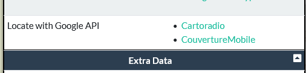

# BetterCellMapper 

BetterCellMapper is a Firefox extension that integrates with [CellMapper](https://www.cellmapper.net/). It adds a Captcha limiter mechanism and a **Locate with Google API** action to the tower information dialog. Clicking one of the provided links queries the Google Geolocation API to estimate the tower's coordinates.

The extension extracts tower parameters from CellMapper's API responses and contacts Google only when you request the location. When available, links to mapping services are shown so you can visualize the result on a map.

## Features

- Adds a new row to the tower details popup with a "Locate with Google API" option.
- Uses the Google Geolocation API to estimate the tower's latitude and longitude.
- Opens the location in Google Maps. For French networks (MCC 208) additional links to **Cartoradio** and **CouvertureMobile** are provided.
- Adds a Captcha limiter mechanism that caches tower requests and reuses the last response when the map hasn't moved
  significantly, reducing server traffic. Statistics about avoided requests are
  displayed on the options page. (Basically fix what CellMapper should, come on guys, is it so hard to implement a cache?).

## Installation

1. Clone or download this repository.
2. In Firefox, open the Add-ons Manager and enable "Debug Add-ons" or open `about:debugging#/runtime/this-firefox`.
3. Click **Load Temporary Add-on** and select the `manifest.json` file from this repository.

## Options

Click the extension icon to open the settings page and enter your Google API key.
You can obtain this key from the Google Cloud Console. Google requires setting
up billing by providing a credit card, but the Geolocation API includes
**10,000 free requests per month**, which is more than enough for typical use.
Your key remains private and is stored only in your browser's local storage.

## Development Notes

- `background.js` intercepts requests to `getTowerInformation` and saves the tower data for the content script.
- `content.js` adds the Locate link to CellMapper's popup and retrieves the location when a link is clicked using the stored key.
- Permissions include access to CellMapper domains, Google APIs, storage, and webRequest for request interception.
- Tower requests are cached in `background.js` and reused when the viewed area
  hasn't changed much to reduce network traffic. Statistics about avoided
  requests are persisted in storage.

## License

This project is licensed under the MIT License. See the [LICENSE](LICENSE) file for details.
